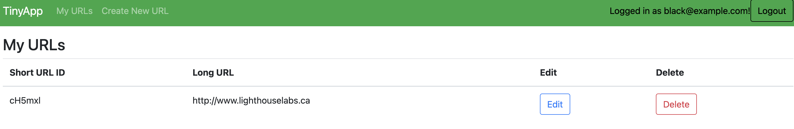
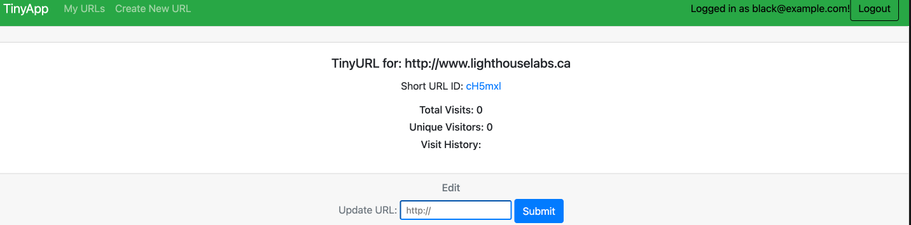

# TinyApp

TinyApp is a simple URL shortening service similar to TinyURL. Users can shorten long URLs and track the number of times they are visited, along with details about the visitors.

## Final Product





## Features

- **URL Shortening**: Users can create a short URL that redirects to a long URL.
- **Visit Tracking**: Each shortened URL tracks the total number of visits and unique visitors.
- **Visit History**: Each visit is logged with the visitor's ID and timestamp.
- **User Authentication**: Users can register, log in, and manage their URLs.
- **Cookie-Based Visitor Tracking**: The app tracks unique visitors using cookies.

## Technologies Used

- Node.js
- Express.js
- EJS for templating
- Cookie-Parser for tracking unique visitors
- Body-Parser to parse incoming requests
- Session for user authentication and session management
- Bootstrap for styling

## Installation

1. Clone the repository:

   ```bash
   git clone https://github.com/Kalaybot/tinyapp

 2. Navigate into project directory:

  
  cd tinyapp

3. Install dependencies:

  
  npm install

4. Start the app:

  
  npm start

